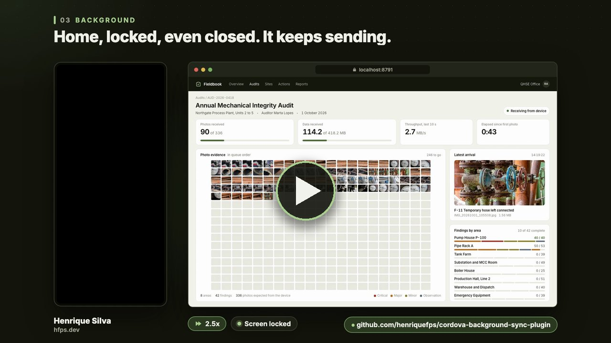

# BackgroundSyncPlugin

A professional, high-resilience **Background Data & Asset Synchronization Engine** designed for hybrid mobile applications (Cordova, Capacitor) using local SQLite/LocalStorage databases.

This plugin delegates the synchronization of offline relational records and heavy binary assets (images, PDFs, videos) to the **native operating system layer (Kotlin on Android / Objective-C on iOS)**. It runs outside the WebView (JavaScript runtime), so WebView suspension does not stop it. On Android it keeps going when the app is closed, minimized, or the device is locked. On iOS it runs while the app is in the foreground and for the short background window iOS grants (about 30 seconds), then pauses and resumes when the app returns or calls `sync()`, with nothing lost (see [Technical Limitations](docs/limitations.md#3-ios-background-life-cycle)). The plugin declares no iOS background modes.

### Demo video

[](https://media.hfps.dev/showcase/background-sync-demo.mp4)

84 seconds, recorded on the Android emulator with the [example app](examples/field-audit-demo/): 336 photos (418 MB) keep syncing with the app in the background, the screen locked and the app closed, and the queue resumes on its own after airplane mode. [Watch the video (MP4)](https://media.hfps.dev/showcase/background-sync-demo.mp4).

---

## 🎯 When is this Plugin Useful?

1. **Heavy Assets Synchronization**: When field operators capture large amounts of media (e.g., 30+ high-res photos during an inspection) and the app cannot freeze the UI or force the user to wait with the app open.
2. **Unbreakable Offline-First Sync**: In environments with unstable network connectivity (field services, logistics, remote mines). Native OS networking manages dropouts, timeouts, and retries seamlessly.
3. **Battery and Data Savings (Android Only)**: Allows syncing to occur selectively (e.g., *only when connected to Wi-Fi* or *only when the device is charging*) to reduce mobile plan costs and save device battery.
4. **Security Background Handshakes**: Running secure REST uploads with server-side API validation completely hidden from the user interface.

---

## 🏗️ How it Works: The Private Queue SQLite Database

Instead of scanning the application's business database or requiring you to manage SQLite tables, this plugin manages its own **private, optionally encrypted SQLite database (`bg_sync.db`)** natively.

You simply interact with the plugin using the exposed JavaScript API to add, read, and remove records in this queue. The native background synchronization worker reads from this queue, executes secure uploads, and automatically manages the transaction states.

### 📋 Record Schema Format for `enqueueRecord`

When adding a record to the sync queue, pass an object with the following fields:

| Field Name | Data Type | Description |
| :--- | :--- | :--- |
| **`id`** | Text (Optional) | Unique identifier. If not provided, a UUID is automatically generated. |
| **`payload`** | Object / Array / Text | The JSON data structure or string to send to the server. |
| **`endpoint`** | Text | The relative path of the REST API to send the payload to (e.g., `/api/v1/sync/inspection`). |
| **`filePath`** | Text (Optional) | The local file URI (e.g. `file:///...`) of any image/asset to be uploaded alongside the payload. |
| **`uploadStrategy`**| Text (Optional) | `"REST_PAYLOAD"` (default) or `"PRESIGNED_URL"` for direct cloud uploads. |

---

## 🧩 JavaScript API Reference

All methods are exposed under `cordova.plugins.BackgroundSyncPlugin` (also `window.BackgroundSyncPlugin` via the plugin's `clobbers` target).

| Method | Description |
| :--- | :--- |
| `initialize(options, success, error)` | Configures the engine (`serverUrl`, `headers`, `syncOnlyOnWifi`, `syncOnlyWhenCharging`, `enableNotifications`, `autoDeleteCompleted`, `encryptDatabase`, `notificationTexts`, `showDebugLogs`). Must be called before any other method. |
| `sync(success, error)` / `enqueueSync(success, error)` | Schedules a single native background run that drains `sync_queue` (uploads) and then `download_queue` (downloads). Both names trigger the same action. |
| `cancelSync(success, error)` | Cancels the currently scheduled/running sync task. Records already completed remain completed; pending/failed records are left untouched. |
| `requestNotificationsPermission(success, error)` | Requests the runtime `POST_NOTIFICATIONS` permission (Android 13+; resolves immediately on older versions). On iOS it shows the system notification prompt the first time and resolves with `true` or `false`. |
| `registerListeners(listeners)` | Registers an object with 7 real-time sync callbacks: `onStarted`/`onProgress`/`onFailed` (upload), `onStarted_download`/`onProgress_download`/`onFailed_download` (download), and a single shared `onCompleted` that fires once after both queues finish — **there is no `onCompleted_download`**. Full payload reference: [Integration Guide → Register Progress Listeners](docs/integration-guide.md#step-2-register-progress-listeners). |
| `onProgress(callback)` | Legacy shorthand that registers only a progress callback (internally calls `registerListeners`). |
| `executeRawQuery(query, args, success, error)` | Runs a raw SQL statement against the plugin's private `bg_sync.db` (`SELECT`/`PRAGMA` return rows; other statements execute directly). |
| `enqueueRecord(record, success, error)` | Adds a record (`id?`, `payload`, `endpoint`, `filePath?`, `uploadStrategy?`) to `sync_queue`. |
| `getQueuedRecords(success, error)` | Returns pending/failed upload records: `[{ id, status, error }]`. |
| `getSyncedRecords(success, error)` | Returns completed upload records: `[{ id, status }]`. |
| `removeRecords(ids, success, error)` | Deletes specific upload records by `id`. |
| `clearQueue(success, error)` | Deletes all rows from `sync_queue`. |
| `enqueueDownload(record, success, error)` | Adds a record (`id?`, `payload?`, `endpoint`, `filePath?`, `downloadStrategy?`) to `download_queue`. |
| `getQueuedDownloads(success, error)` | Returns pending/failed download records: `[{ id, status, error }]`. |
| `getCompletedDownloads([options], success, error)` | Returns `{ records: [...], hasMore }` for completed downloads. Optional `{ limit, offset }` enables pagination. If `autoDeleteCompleted` is `true`, returned records are deleted from the queue and any `offset` you pass is ignored server-side (the same flag deletes each upload as soon as it is sent, so `getSyncedRecords` then returns nothing); see [Background Downloads Guide → Fetch Completed Downloads](docs/background-downloads.md#3-fetch-completed-downloads-access-json-results) for the correct pagination loop in each case. |
| `removeDownloads(ids, success, error)` | Deletes specific download records by `id`. |
| `clearDownloadQueue(success, error)` | Deletes all rows from `download_queue`. |
| `openDatabaseInspector(success, error)` | Opens a native full-screen recovery/inspection UI (WKWebView on iOS, WebView on Android) over the plugin's private database — browse both queues, delete stuck records, and export everything as JSON. Intended for manual recovery/debugging, not end-user-facing production flows. |

For enqueue/download payload shapes, event details, and server-side contracts, see the [Technical Documentation](docs/README.md).

---

## Example app

[`examples/field-audit-demo/`](examples/field-audit-demo/) is a complete, runnable demo for Android and the iOS simulator: a Capacitor audit app that queues 336 photos (418 MB) with `enqueueRecord` and `enqueueSync`, plus a zero-dependency Node backoffice that implements the [REST contract](docs/rest-api-signature.md) and fills a live photo grid as uploads arrive. It shows the sync continuing with the app in the background and the screen locked, and the queue resuming on its own after airplane mode. The app uses this repository's plugin directly (`file:../../..`).

```sh
cd examples/field-audit-demo
python3 seed/fetch_sources.py --target 100 && python3 seed/generate_audit.py
node backoffice/server.mjs &
scripts/build.sh && scripts/seed-device.sh         # Android emulator
scripts/ios-build.sh && scripts/ios-seed.sh         # iOS simulator
```

Requirements, the full walkthrough and what was verified are in its [README](examples/field-audit-demo/README.md).

---

## 📚 Technical Documentation

All implementation details, API usage examples, and server configuration requirements are organized into modular technical guides:

* **[Technical Documentation Index](docs/README.md)** - Entry point for the plugin documentation.
* **[Integration & Usage Guide](docs/integration-guide.md)** - Step-by-step guide to JavaScript API integration, database initialization, and record queues.
* **[Bypassing WebView 60s Timeouts](docs/bypassing-timeouts.md)** - Detailed explanation of Android WorkManager/Foreground Services and iOS background tasks.
* **[Technical Limitations & Limits](docs/limitations.md)** - Key OS constraints, page size support, and RAM limit warnings.
* **[Required Signature for Exposed REST APIs](docs/rest-api-signature.md)** - Contracts, JSON request body schemas, and base64-encoded files metadata structure.
* **[Automatic Network Retry & Recovery Policy](docs/retry-policy.md)** - Auto-scheduling retries on network drops and transient errors.
* **[Manually Cancelling Synchronization](docs/cancel-sync.md)** - How to pause and resume the sync queue using the JS API.
* **[Live Progress & Status Notifications](docs/notifications.md)** - Toggling notification alerts, translations, and silent progress updates.

---

## 🏢 Developed by

**Author**: Henrique Silva (<contact@hfps.dev>)
**Website**: [hfps.dev](https://hfps.dev)
**Company**: hfps
