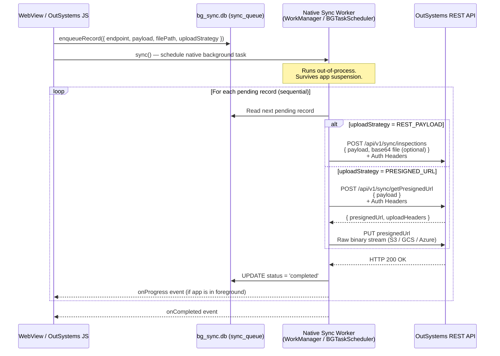
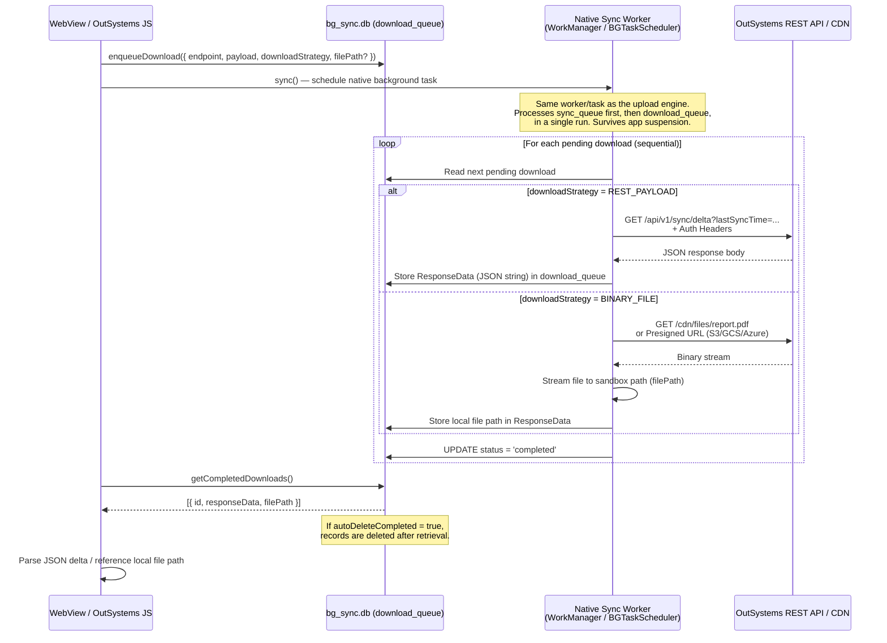

# BackgroundSyncPlugin - Technical Documentation

Welcome to the technical documentation for the **BackgroundSyncPlugin**. This documentation is divided into specific guides covering the architectural decisions, constraints, integration requirements, and recovery features of the plugin.

---

## 📚 Documentation Index

Select one of the topics below to learn more:

### 1. [Integration & Usage Guide](integration-guide.md)
Step-by-step walkthrough of how to integrate the sync queue table, initialize the plugin, write event listeners, and apply decoupled progress updates.

### 2. [Bypassing the 60s WebView Timeout](bypassing-timeouts.md)
Learn how the plugin delegates upload requests to native operating system layers (Android WorkManager and iOS Background Tasks) to bypass the standard 60-second hybrid browser execution limits.

### 3. [Technical Plugin Limitations & Per-Record Limits](limitations.md)
Read about operating system restrictions, SQLite auto-discovery mechanics, and critical limits on RAM consumption (especially on iOS for large media files) to prevent application crashes.

### 4. [Required Signature for Exposed REST APIs](rest-api-signature.md)
View the consolidated JSON payload formats, multipart-like structures for file attachments, and code examples for exposed backend endpoints receiving synchronization data.

### 5. [Automatic Network Retry & Recovery Policy](retry-policy.md)
Understand how the plugin automatically retries failed sync jobs when connection is restored, utilizing WorkManager constraints on Android and connectivity listeners on iOS.

### 6. [Manually Cancelling Synchronization](cancel-sync.md)
Guide on utilizing the JavaScript API to safely cancel active sync flows, preserve already uploaded records, and restart the queue later.

### 7. [Live Progress & Status Notifications](notifications.md)
Documenting how the plugin handles background notifications, custom translations, toggles, and silent progress updates.

### 8. [Advanced Sync Patterns: One-to-Many Attachments](advanced-one-to-many-sync.md)
Architectural guide on synchronizing records with multiple heavy file attachments (e.g. Inspections with N photos) using normalized sequential queue scheduling.

### 9. [API Authentication Strategies](api-authentication.md)
Securing exposed REST endpoints with rotating API Keys (Basic) or OAuth 2.0 Access/Refresh Token handshakes (Advanced).

### 10. [Direct Cloud Uploads via Presigned URLs](presigned-url-uploads.md)
Direct binary streaming to Object Storage (AWS S3, Google Cloud Storage, Azure Blob Storage) using dynamic upload metadata and headers generated by the OutSystems backend.

### 11. [Manual Recovery: The Database Inspector](database-inspector.md)
A built-in native recovery/debugging screen for browsing, deleting, and exporting the private queue database when a device's sync gets permanently stuck — plus what to consider before exposing it in production.

---

## 🛠️ Architecture Overview

The plugin operates on a **private, dedicated SQLite/SQLCipher database (`bg_sync.db`)**, completely decoupled from the OutSystems business database to prevent deadlocks. It exposes two independent synchronization engines: **Upload** and **Download**.

---

### ⬆️ Upload Architecture (Foreground → Background → Backend)

The upload flow moves offline-captured data from the device to the OutSystems backend REST API — even when the app is backgrounded or the device is locked.

**Key points:**

- `sync_queue` table stores each pending operation with its `endpoint`, `payload`, optional `filePath`, and `uploadStrategy`.
- Auth is passed via global `headers` set during `initialize()` (Bearer token, API key, etc.).
- `PRESIGNED_URL` strategy offloads binary uploads directly to object storage (S3, GCS, Azure Blob) without routing through your OutSystems server.
- The worker updates `status` → `completed` or `failed` per record, enabling partial recovery.

---

### ⬇️ Download Architecture (Backend → Background → Device)

The download flow retrieves server-side updates (JSON deltas and binary files) in the background, storing them locally on the device for the app to consume on next resume.

**Key points:**

- There is no separate "download sync" trigger — the same `sync()` call used for uploads also drains `download_queue` in the same worker run (uploads are processed first, then downloads).
- `download_queue` table stores each pending download with its `endpoint`, `downloadStrategy` (`REST_PAYLOAD` or `BINARY_FILE`), and optional target `filePath`.
- `REST_PAYLOAD` downloads store the full JSON response body in `ResponseData` for the app to parse later.
- `BINARY_FILE` downloads stream the content directly to a sandboxed device path — ideal for images, PDFs, and video.
- The app calls `getCompletedDownloads()` to consume results. If `autoDeleteCompleted` is `true`, records are atomically deleted after being returned — following a queue consumption pattern.
- Auth headers configured in `initialize()` are automatically forwarded on every download request.

---

For setup and client-side API reference, refer to the main [README.md](../README.md) at the root of this project.
