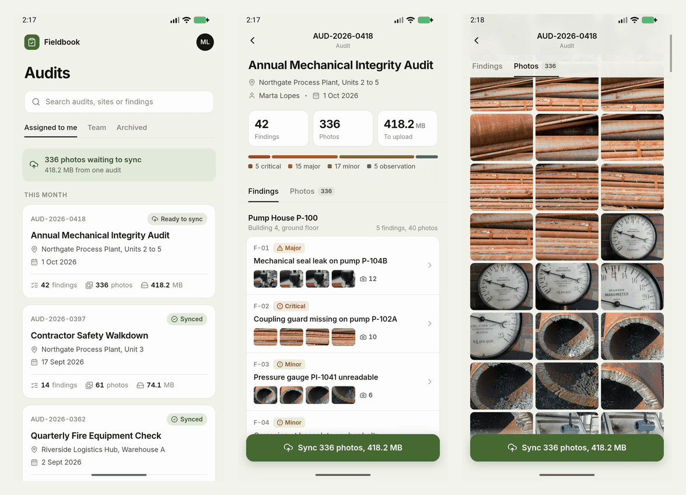
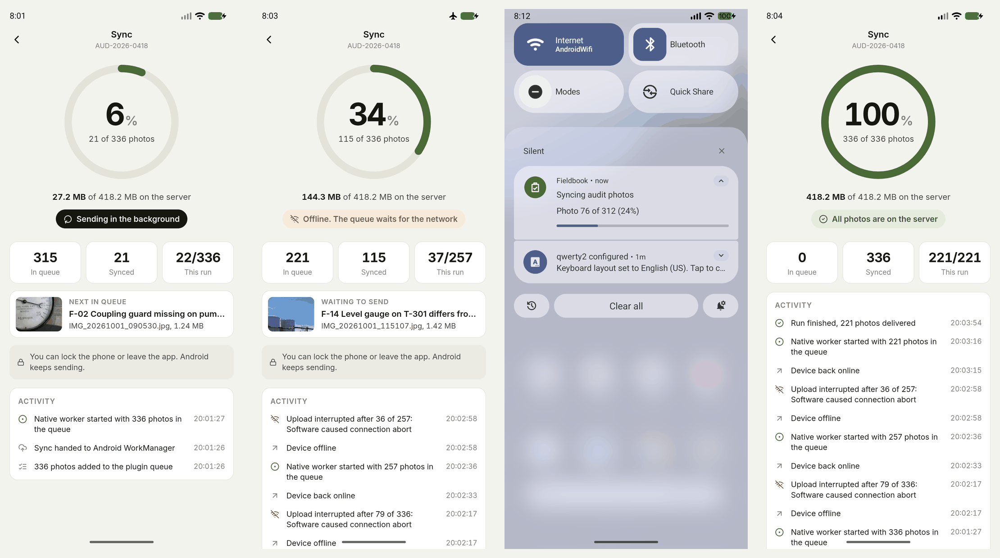
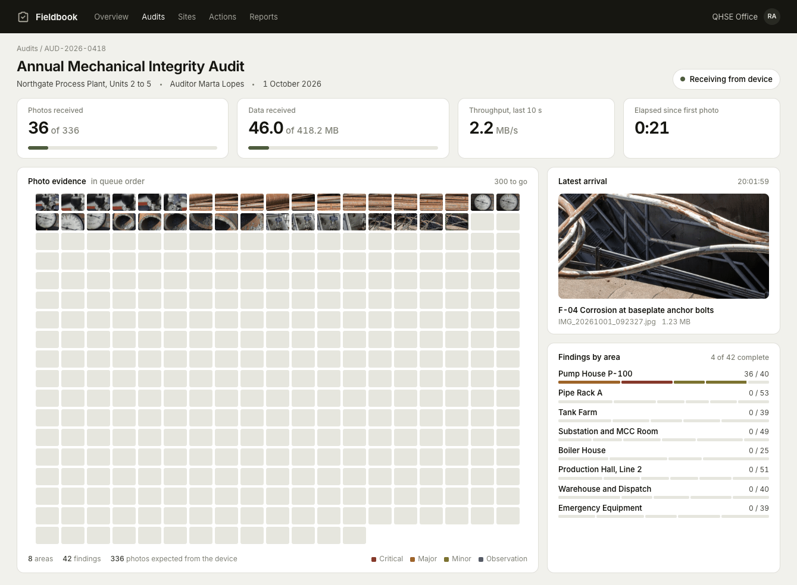
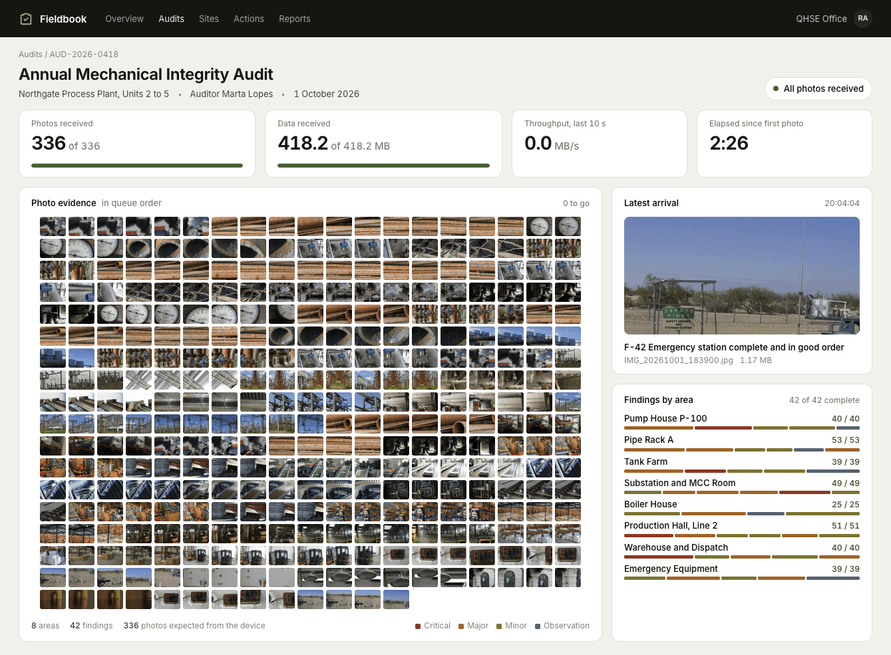

# Field audit demo

A realistic demo of the Background Sync plugin, built for the article and video
about its first real project: an audit app where auditors photograph every
finding at an industrial site, and the photos are most of what syncs.

- **Fieldbook** (`app/`): a Capacitor app for Android with one large audit
  (42 findings, 336 photos, 418.2 MB) and two small, already synced ones.
  Tapping **Sync** puts one record per photo into the plugin queue with
  `enqueueRecord` (id, JSON payload, endpoint, `filePath`) and calls
  `enqueueSync`. The sync screen is driven only by the plugin: the
  `onStarted`/`onProgress`/`onFailed`/`onCompleted` listeners and the
  `getQueuedRecords`/`getSyncedRecords` queries.
- **Backoffice** (`backoffice/`): a zero-dependency Node server that implements
  the REST contract in [docs/rest-api-signature.md](../../docs/rest-api-signature.md)
  and a live page that fills a 336-slot photo grid as uploads arrive, with
  counters, MB received, throughput and progress per area and finding.
- **Seed data** (`seed/`): the audit and its photos, generated from openly
  licensed Wikimedia Commons pictures (see [CREDITS.md](CREDITS.md)). The
  photos are not committed. `seed/sources.json` pins the exact source files,
  so `fetch_sources.py` and `generate_audit.py` rebuild the same 336 photos,
  byte for byte, that `app/src/data/audit.json` describes. Commons search
  results drift, so `fetch_sources.py --search` (the original discovery) now
  returns different pictures; use it only to build a new audit.
- **Takes** (`video/record-takes.mjs`): a scripted, reproducible recording of
  one real sync, split into takes for the video.

The plugin itself is used as is, from the repository root (`file:../../..`).

## Requirements

- Android SDK with an emulator (tested on the `Medium_Phone_API_36.1` AVD,
  Android 16, 1080x2400), `adb`, JDK 21 (Android Studio's bundled JBR works).
- Node 18 or later, Python 3 with Pillow and NumPy (only to regenerate photos),
  `ffmpeg`/`ffprobe` (only for the takes). macOS `sips` makes the backoffice
  thumbnails; without it the page shows the full images.

## Run it

```sh
# 1. Photos: download the pinned sources, then build the 336 photos (about 3 minutes)
python3 seed/fetch_sources.py             # the 100 files listed in seed/sources.json
python3 seed/generate_audit.py            # writes seed/out/ and app/src/data/audit.json

# 2. Backoffice, reachable from the emulator at http://10.0.2.2:8791
node backoffice/server.mjs                # open http://localhost:8791

# 3. App: build, install and copy the photos into the app's files dir
emulator -avd Medium_Phone_API_36.1 &
scripts/build.sh
scripts/seed-device.sh

# Back to "not synced" at any time (photos stay on the device)
scripts/reset-device.sh && curl -X POST localhost:8791/api/reset
```

`seed-device.sh` copies the photos through `/data/local/tmp` with `run-as`,
because files that `adb push` writes into `Android/data` belong to the shell
user and the app cannot read them.

## How long a sync takes, and why

The emulator's user-mode network moves about 30 Mbit/s up to the host, which
is in the range of a good 4G uplink, so the whole audit takes a little over
two minutes with no extra limit. The backoffice can also cap its ingest rate
(`RATE_MBPS=32 node backoffice/server.mjs`, or
`curl -X POST 'localhost:8791/api/rate?mbps=32'`). The cap reads each request
body no faster than the given rate, so TCP backpressure slows the phone's
upload the way a constrained uplink would. The takes use a 32 Mbit/s cap so
runs are repeatable across machines. Measured on the emulator: 132 s for the
whole audit with no cap; with the 32 Mbit/s cap, 178 s from the first to the
last photo in the recorded run, of which 19 s were the airplane mode cut and
the reconnect. Every count and MB figure on both screens
is real: the phone shows the plugin's events and queue, the backoffice shows
the files it stored. Base64 adds a third on the wire, so 418 MB of photos is
about 560 MB of request bodies.

## Recording the takes

```sh
cd video && npm install
node record-takes.mjs --out ~/fieldaudit-takes   # default: <system temp dir>/fieldaudit-takes
```

The script resets the device and the backoffice, then runs one continuous sync
and records five takes. Each take folder has `phone.mp4` (screenrecord,
1080x2400), `backoffice.mp4` (Chromium screencast, 1440x900) and `events.json`
(`{ t, event }`, seconds from the take start). Both videos are trimmed to the
same window. While the phone screen is off, `phone.mp4` is black, because
screenrecord gets no frames from a display that is off.

| Take | What happens |
| --- | --- |
| `01-audit` | Browse the audit: findings by area, severity, the 336-photo grid. Backoffice waits. |
| `02-sync-start` | Tap Sync. The queue fills, the native worker starts, the backoffice grid starts filling. |
| `03-background` | Home, notification shade with progress, app swiped away from recents, screen off, lock screen with the progress notification. Uploads continue. |
| `04-offline` | Unlock, reopen the app, airplane mode on: the upload is interrupted and the app shows it. Airplane mode off: the queue resumes on its own. |
| `05-done` | All photos on the server, counts match, the app shows the audit as synced. |

The script also sets up the demo device: a swipe lock screen that shows silent
notifications, notification minimalism off, and empty recents and shade.

## What was verified, and one plugin issue

Verified against plugin 1.0.4 on the Android 16 emulator, with server counts,
md5 sums, `dumpsys` and logcat:

- End state: 336 of 336 photos and 418,184,992 bytes on the server, md5
  identical to the seeded files, and 336 records `completed` in the plugin's
  queue database.
- App at Home, then screen off: uploads continue (21 photos on the server when
  the app went to the background, 79 after 20 s with the screen off), and the
  progress notification follows them (`Photo 80 of 336 (23%)`).
- Airplane mode mid-run, with the app in the background and the screen off,
  and again with the app open: WorkManager stops the worker (network
  constraint), the in-flight upload fails as transient, and the queue resumes
  3 to 6 seconds after the connection is back, without user action. The upload
  that was in flight when the connection dropped can reach the server anyway,
  so it is sent again. The backoffice replaces the entry and logs `(re-sent)`.
  It is never counted twice.

Issue, still present in 1.0.4: when the retry starts while the app is in the
background, Android 12+ does not let the worker start its foreground service:

```
W/ActivityManager: startForegroundService() not allowed due to mAllowStartForeground false: service com.hfps.fieldaudit/androidx.work.impl.foreground.SystemForegroundService
W/BackgroundSyncPlugin: Failed to run as Foreground Service: ... Falling back to standard background execution.
```

`SyncWorker` continues as a regular background worker, so the uploads go on
and the run completes, but it is no longer protected as a foreground service.
The progress notification keeps updating for about a minute after the app
left the foreground. Then every update fails:

```
W/BackgroundSyncPlugin: Failed to update Foreground Service progress notification: Not allowed to start service Intent { act=ACTION_NOTIFY ... SystemForegroundService }: app is in background
```

From then on the notification is frozen. In the recorded run it stayed at
`Photo 76 of 312 (24%)` for 2 minutes 20 seconds while the server went from
101 to 334 photos, until the success notification replaced it. The take
`04-offline` therefore cuts the connection with the app open.

The plugin's Android side now posts the progress with `NotificationManager`
directly, so it keeps advancing in that case (an expedited request was tried
and does not help); see [docs/notifications.md](../../docs/notifications.md).
`tests/notification-background.mjs` reproduces the scenario, and
[tests/RESULTS-android.md](tests/RESULTS-android.md) has the before/after
evidence and the full Android test matrix.

## Tests

[tests/](tests/README.md) has scripted Android tests that drive the plugin
inside this app over adb and the WebView's DevTools protocol, with fault
injection in the backoffice (HTTP errors, slow, dropped and hung requests).

## Screenshots





